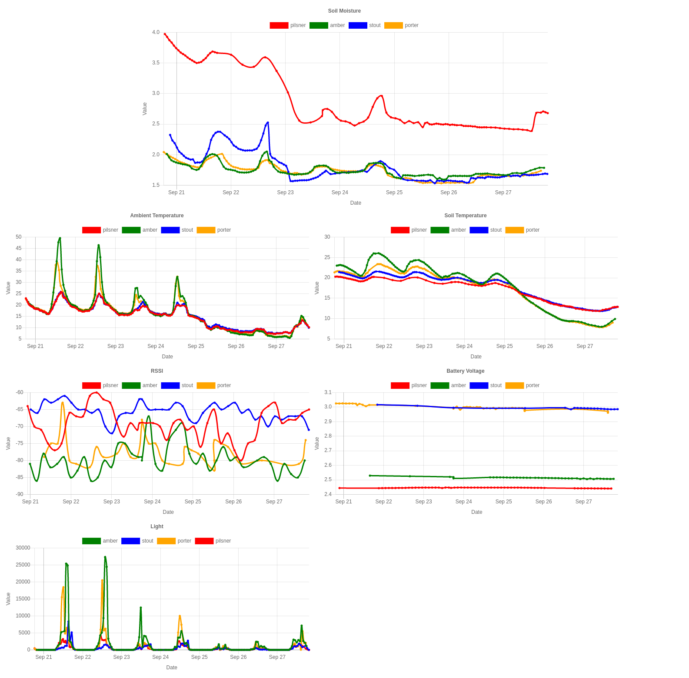

# koubachi-goserver
this is a self hosted server for koubachi plant sensors.
it saves the readings into a local sqlite database and displays them in a series of [charts](https://www.chartjs.org/).



inspired by https://github.com/koalatux/koubachi-pyserver

### koubachi server address

change koubachi endpoint and wi-fi access (see https://github.com/koubachi-sensor/api-docs#change-the-sensors-server-address)

set enpoint using curl
```
curl -X GET -G http://172.29.0.1/sos_config -d host=192.168.1.120 -d port=8005
```
### run
create a config file (see `config/config.yml.example`)

just build and run as a container using
```
docker build -t koubachi-goserver .
docker run -v $(pwd)/config:/app/config:ro -v $(pwd)/readings:/app/readings -p 8005:8005 koubachi-goserver
```
to build with [gin](https://github.com/gin-gonic/gin) in debug mode use
```
docker build --build-arg gin_mode=debug -t koubachi-goserver .
```

### display charts
just call address in your browser (i.E. http://localhost:8005/)

### sqlite tables
```
create table readings
(
    id             INTEGER
        constraint readings_pk
            primary key autoincrement,
    device         INTEGER not null
        references devices,
    rawvalue       REAL,
    convertedvalue REAL,
    timestamp      INTEGER not null,
    sensor         INTEGER not null
        references sensors
);

create table devices
(
    id         INTEGER
        constraint devices_pk
            primary key autoincrement,
    macaddress TEXT,
    name       TEXT
);

create unique index devices_macaddress_uindex
    on devices (macaddress);

create table sensors
(
    id   INTEGER
        constraint sensors_pk
            primary key autoincrement,
    name TEXT not null
);

create unique index sensors_name_uindex
    on sensors (name);
```